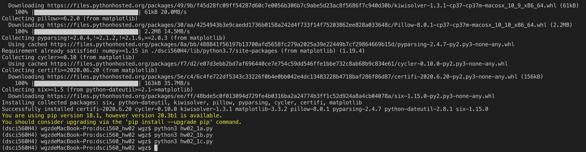
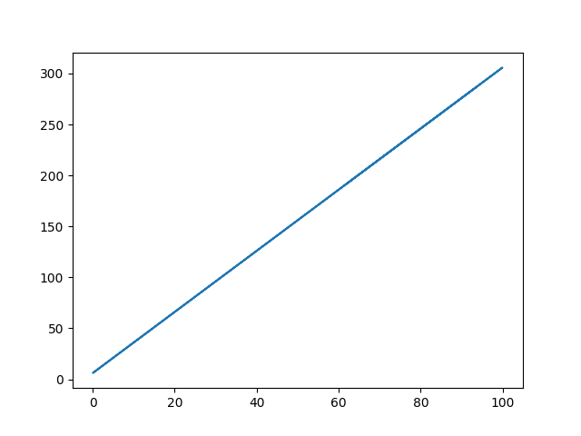
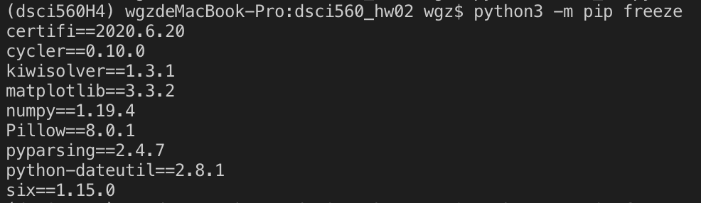

# dsci560_hw02
Homework 2 of Data Science Course DSCI560 at University of Southern California

Link to FigShare:  
  - problem 1a: https://doi.org/10.6084/m9.figshare.12998945  
  - problem 1b: https://doi.org/10.6084/m9.figshare.12998987  
  - problem 1c: https://doi.org/10.6084/m9.figshare.12998744
  
How to start:  
  - problem 1a: python3 hw02_1a.py, output file name: hw02_1a.txt  
  - problem 1b: python3 hw02_1b.py, output file name: hw02_1b.txt  
  - problem 1c: python3 hw02_1c.py, output file name: hw02_1c.png  
  
 Zenodo 

# Homework 04

The virtual environment is runable on a MAC OS computer with python>=3.5 installed.

### Create virtual environment

Install virtual environment:

`pip3 install virtualenv`

Start the virtual environment:

`python3 -m venv dsci560H4`

### Activate and install dependencies

Activate it:

`source dsci560H4/bin/activate`

Add dependencies(we need to install numpy and matplotlib):

`pip3 install numpy`
`pip3 install matplotlib`

### Run script:

`python3 hw02_1a.py`
`python3 hw02_1b.py`
`python3 hw02_1c.py`

And we have the terminal:

    

And result:

    

### Extract Dependencies

Run `pip3 freeze`

    

We find that we have `numpy` and `matplotlib` here. But some other dependencies we have not manually added are here as well. These are the dependencies of numpy or matplotlib. For example, dependency `six` is a dependency of `numpy`.

Run `pip3 freeze > requirements.txt` to create a file including the extracted dependencies

### Binder

